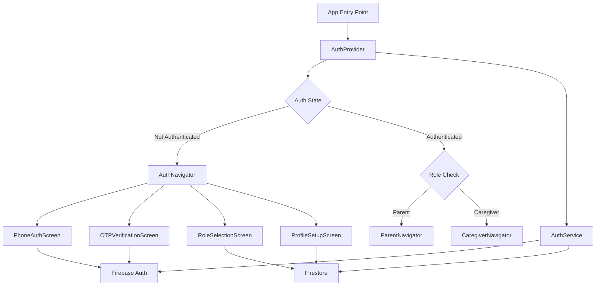
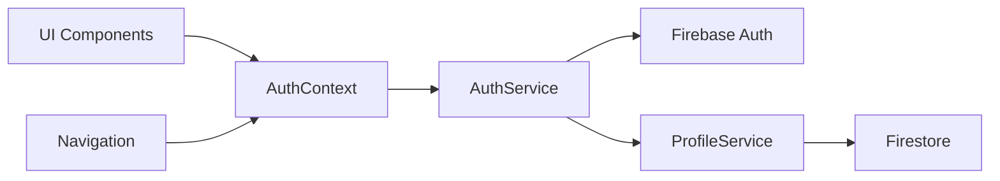
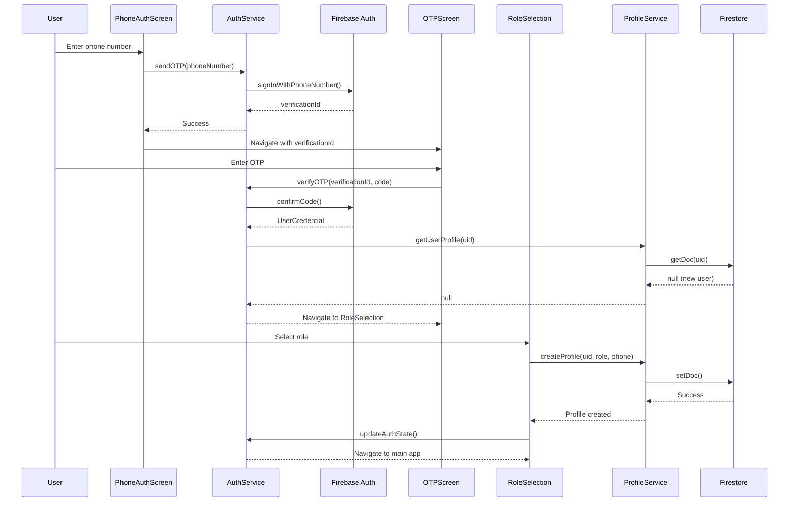

# Design Document: Authentication & User Management System

## Overview

The Authentication & User Management System provides a secure, user-friendly phone-based authentication flow for the PillSathi React Native app. The system integrates Firebase Authentication for phone verification, Firestore for user profile storage, and React Context for state management across the application.

The design follows a modular architecture with clear separation between authentication logic, profile management, and UI components. It leverages Firebase's built-in phone authentication capabilities while providing a seamless user experience with proper error handling, loading states, and accessibility support.

### Key Design Decisions

1. **Phone Authentication**: Using Firebase Phone Authentication provides SMS delivery, OTP verification, and security out of the box
2. **Context-based State Management**: React Context provides a lightweight, built-in solution for sharing auth state without external dependencies
3. **Firestore for Profiles**: Storing user profiles in Firestore enables real-time sync and offline support
4. **Role-based Navigation**: Using separate navigators (ParentNavigator, CaregiverNavigator) provides clear separation of concerns
5. **UID as Document ID**: Using Firebase Auth UID as the Firestore document ID creates a natural link between authentication and profile data

## Architecture

### High-Level Architecture



### Component Architecture



### Authentication Flow



## Components and Interfaces

### 1. AuthContext

Provides authentication state and methods throughout the app using React Context.

**State:**

```javascript
{
  user: {
    uid: string,
    phoneNumber: string,
    profile: {
      name: string,
      role: 'parent' | 'caregiver',
      phone: string,
      createdAt: timestamp
    } | null
  } | null,
  loading: boolean,
  error: string | null
}
```

**Methods:**

```javascript
/**
 * Send OTP to phone number
 * @param {string} phoneNumber - Phone number with country code (e.g., +1234567890)
 * @returns {Promise<string>} verificationId for OTP confirmation
 * @throws {Error} If phone number is invalid or SMS sending fails
 */
sendOTP(phoneNumber);

/**
 * Verify OTP code
 * @param {string} verificationId - ID from sendOTP
 * @param {string} code - 6-digit OTP code
 * @returns {Promise<UserCredential>} Firebase user credential
 * @throws {Error} If code is invalid or expired
 */
verifyOTP(verificationId, code);

/**
 * Create user profile after authentication
 * @param {string} uid - Firebase Auth UID
 * @param {Object} profileData - Profile data {name, role, phone}
 * @returns {Promise<void>}
 * @throws {Error} If profile creation fails
 */
createProfile(uid, profileData);

/**
 * Update existing user profile
 * @param {string} uid - Firebase Auth UID
 * @param {Object} updates - Partial profile data to update
 * @returns {Promise<void>}
 * @throws {Error} If update fails
 */
updateProfile(uid, updates);

/**
 * Sign out current user
 * @returns {Promise<void>}
 */
signOut();

/**
 * Resend OTP to the same phone number
 * @param {string} phoneNumber - Phone number with country code
 * @returns {Promise<string>} New verificationId
 * @throws {Error} If resend fails or rate limited
 */
resendOTP(phoneNumber);
```

### 2. AuthService

Core service handling Firebase Authentication operations.

**Interface:**

```javascript
class AuthService {
  /**
   * Initialize Firebase Auth listener
   * @param {Function} onAuthStateChanged - Callback for auth state changes
   * @returns {Function} Unsubscribe function
   */
  initAuthListener(onAuthStateChanged)

  /**
   * Send OTP via Firebase Phone Auth
   * @param {string} phoneNumber - Phone number with country code
   * @returns {Promise<{verificationId: string}>}
   * @throws {AuthError} With code and message
   */
  async sendPhoneOTP(phoneNumber)

  /**
   * Verify OTP code
   * @param {string} verificationId - Verification ID from sendPhoneOTP
   * @param {string} code - 6-digit OTP
   * @returns {Promise<UserCredential>}
   * @throws {AuthError} If verification fails
   */
  async verifyPhoneOTP(verificationId, code)

  /**
   * Sign out current user
   * @returns {Promise<void>}
   */
  async signOut()

  /**
   * Get current authenticated user
   * @returns {FirebaseAuthUser | null}
   */
  getCurrentUser()

  /**
   * Map Firebase error codes to user-friendly messages
   * @param {string} errorCode - Firebase error code
   * @returns {string} User-friendly error message
   */
  getErrorMessage(errorCode)
}
```

### 3. ProfileService

Service for managing user profiles in Firestore.

**Interface:**

```javascript
class ProfileService {
  /**
   * Create new user profile
   * @param {string} uid - Firebase Auth UID
   * @param {Object} profileData - {name, role, phone}
   * @returns {Promise<void>}
   * @throws {Error} If creation fails or validation fails
   */
  async createProfile(uid, profileData)

  /**
   * Get user profile by UID
   * @param {string} uid - Firebase Auth UID
   * @returns {Promise<Object | null>} Profile data or null if not found
   */
  async getProfile(uid)

  /**
   * Update user profile
   * @param {string} uid - Firebase Auth UID
   * @param {Object} updates - Partial profile data
   * @returns {Promise<void>}
   * @throws {Error} If update fails
   */
  async updateProfile(uid, updates)

  /**
   * Validate profile data
   * @param {Object} profileData - Profile data to validate
   * @returns {boolean} True if valid
   * @throws {Error} If validation fails with specific message
   */
  validateProfileData(profileData)

  /**
   * Check if user profile exists
   * @param {string} uid - Firebase Auth UID
   * @returns {Promise<boolean>}
   */
  async profileExists(uid)
}
```

### 4. UI Components

**PhoneAuthScreen:**

- Input field for phone number with country code picker
- Send OTP button with loading state
- Phone number validation and formatting
- Error display

**OTPVerificationScreen:**

- 6-digit OTP input field
- Verify button with loading state
- Resend OTP button with countdown timer
- Error display

**RoleSelectionScreen:**

- Two role option cards (Parent, Caregiver)
- Role descriptions
- Selection confirmation

**ProfileSetupScreen:**

- Name input field
- Save button with loading state
- Profile validation

## Data Models

### User Profile (Firestore Document)

**Collection:** `users`  
**Document ID:** Firebase Auth UID

```javascript
{
  uid: string,              // Firebase Auth UID (redundant but useful)
  phoneNumber: string,      // E.164 format (e.g., +1234567890)
  role: string,             // 'parent' | 'caregiver'
  name: string,             // User's display name
  createdAt: Timestamp,     // Firestore server timestamp
  updatedAt: Timestamp,     // Firestore server timestamp
  lastLoginAt: Timestamp    // Updated on each login
}
```

**Firestore Security Rules:**

```javascript
rules_version = '2';
service cloud.firestore {
  match /databases/{database}/documents {
    match /users/{userId} {
      // Users can only read/write their own profile
      allow read, write: if request.auth != null && request.auth.uid == userId;

      // Validate required fields on create
      allow create: if request.auth != null
        && request.auth.uid == userId
        && request.resource.data.keys().hasAll(['uid', 'phoneNumber', 'role', 'name'])
        && request.resource.data.role in ['parent', 'caregiver'];

      // Validate updates don't change uid or phoneNumber
      allow update: if request.auth != null
        && request.auth.uid == userId
        && request.resource.data.uid == resource.data.uid
        && request.resource.data.phoneNumber == resource.data.phoneNumber;
    }
  }
}
```

### Auth State (React Context)

```javascript
{
  user: {
    uid: string,
    phoneNumber: string,
    emailVerified: boolean,
    metadata: {
      creationTime: string,
      lastSignInTime: string
    }
  } | null,
  profile: {
    uid: string,
    phoneNumber: string,
    role: 'parent' | 'caregiver',
    name: string,
    createdAt: Date,
    updatedAt: Date,
    lastLoginAt: Date
  } | null,
  loading: boolean,
  initialized: boolean,
  error: string | null
}
```

### Error Codes Mapping

```javascript
const ERROR_MESSAGES = {
  'auth/invalid-phone-number': 'Please enter a valid phone number',
  'auth/missing-phone-number': 'Phone number is required',
  'auth/quota-exceeded': 'Too many requests. Please try again later',
  'auth/user-disabled': 'This account has been disabled',
  'auth/invalid-verification-code':
    'Invalid verification code. Please try again',
  'auth/invalid-verification-id':
    'Verification session expired. Please request a new code',
  'auth/code-expired':
    'Verification code has expired. Please request a new code',
  'auth/too-many-requests': 'Too many attempts. Please try again later',
  'auth/network-request-failed': 'Network error. Please check your connection',
  'firestore/permission-denied':
    'Permission denied. Please try logging in again',
  'firestore/unavailable': 'Service temporarily unavailable. Please try again',
  default: 'An error occurred. Please try again',
};
```

## Correctness Properties

_A property is a characteristic or behavior that should hold true across all valid executions of a system—essentially, a formal statement about what the system should do. Properties serve as the bridge between human-readable specifications and machine-verifiable correctness guarantees._

### Property 1: Valid Phone Number OTP Sending

_For any_ valid phone number in E.164 format (with country code), calling sendOTP should successfully invoke Firebase Authentication's signInWithPhoneNumber method and return a verificationId.

**Validates: Requirements 1.1**

### Property 2: Invalid Phone Number Rejection

_For any_ phone number that does not conform to E.164 format (missing country code, invalid length, non-numeric characters), the validation should reject it and prevent OTP sending.

**Validates: Requirements 1.2**

### Property 3: Firebase Error Code Mapping

_For any_ Firebase Authentication error code, the error mapping function should return a user-friendly error message (never returning undefined or the raw error code).

**Validates: Requirements 1.4, 6.2**

### Property 4: Invalid OTP Error Handling

_For any_ invalid OTP code (wrong length, non-numeric, incorrect value), the verification should fail with an appropriate error message and maintain the ability to retry.

**Validates: Requirements 1.6**

### Property 5: Role Storage Persistence

_For any_ valid role selection ('parent' or 'caregiver'), storing the role should result in a Firestore document where the role field matches the selected value.

**Validates: Requirements 2.2**

### Property 6: Role-Based Navigation Access

_For any_ authenticated user with a role, the navigation system should grant access exclusively to the navigator matching their role (ParentNavigator for 'parent', CaregiverNavigator for 'caregiver').

**Validates: Requirements 2.5, 2.6, 5.2, 5.3**

### Property 7: Profile Document ID Invariant

_For any_ user profile creation, the Firestore document ID must equal the Firebase Auth UID provided during creation.

**Validates: Requirements 3.2**

### Property 8: Profile Required Fields Completeness

_For any_ user profile stored in Firestore, the document must contain all required fields: uid, phoneNumber, role, name, and createdAt timestamp.

**Validates: Requirements 3.3**

### Property 9: Profile Update Persistence

_For any_ profile update operation with valid data, the changes should be reflected in the Firestore document when subsequently retrieved.

**Validates: Requirements 3.4**

### Property 10: Profile Retrieval Consistency

_For any_ UID, calling getProfile should return the complete profile object if a document exists, or null if no document exists (never returning partial data or throwing an error for non-existent profiles).

**Validates: Requirements 3.6**

### Property 11: Profile Validation Enforcement

_For any_ profile data object missing one or more required fields (name, role, phone), the validation function should reject it and prevent saving to Firestore.

**Validates: Requirements 3.7**

### Property 12: Authentication State Persistence

_For any_ successful authentication, the authentication state should be persisted locally such that it can be retrieved on subsequent app launches.

**Validates: Requirements 4.1**

### Property 13: Session Restoration from Valid State

_For any_ valid persisted authentication state, restoring the session should result in an authenticated user context with the correct UID and profile data.

**Validates: Requirements 4.3**

### Property 14: Auth Context State Propagation

_For any_ component consuming the Auth Context, it should receive the current authentication state (user, profile, loading, error) that matches the actual auth state.

**Validates: Requirements 4.6**

### Property 15: Auth State Change Notification

_For any_ authentication state change (login, logout, profile update), all components subscribed to the Auth Context should be notified and receive the updated state.

**Validates: Requirements 4.7**

### Property 16: Unauthenticated Access Control

_For any_ unauthenticated state (user is null), the navigation system should only display AuthNavigator screens and prevent access to protected routes.

**Validates: Requirements 5.1**

### Property 17: Unauthorized Access Redirection

_For any_ attempt to access a protected route while unauthenticated, the navigation system should redirect to the login screen.

**Validates: Requirements 5.4**

### Property 18: Auth-to-Unauth Navigation Transition

_For any_ state transition from authenticated to unauthenticated (logout, token expiration), the navigation system should immediately navigate to the AuthNavigator.

**Validates: Requirements 5.5**

### Property 19: Authentication Error Logging

_For any_ authentication error (Firebase Auth error, Firestore error, validation error), an error log entry should be created with the error details.

**Validates: Requirements 6.6**

### Property 20: Loading State UI Disabling

_For any_ loading state (sending OTP, verifying OTP, creating profile), all interactive UI elements should be disabled to prevent duplicate submissions.

**Validates: Requirements 7.6**

### Property 21: Accessibility Labels Completeness

_For any_ input field in the authentication screens, an accessible label (accessibilityLabel or aria-label) should be present for screen reader support.

**Validates: Requirements 8.1, 8.2**

### Property 22: Touch Target Minimum Size

_For any_ interactive element (button, input, touchable), the touch target dimensions should be at least 44x44 points to meet accessibility standards.

**Validates: Requirements 8.4**

### Property 23: Focus Indicator Presence

_For any_ focusable interactive element, a visible focus indicator should be present when the element receives focus.

**Validates: Requirements 8.6**

## Error Handling

### Error Categories

**1. Authentication Errors**

- Invalid phone number format
- SMS sending failures
- Invalid or expired OTP
- Rate limiting (too many attempts)
- Network connectivity issues
- User account disabled

**2. Profile Management Errors**

- Firestore permission denied
- Firestore service unavailable
- Invalid profile data
- Missing required fields
- Profile creation/update failures

**3. State Management Errors**

- Context initialization failures
- State persistence failures
- State restoration failures

### Error Handling Strategy

**User-Facing Errors:**

- Display clear, actionable error messages
- Provide retry mechanisms for transient failures
- Show specific guidance for user-correctable errors (e.g., "Please enter a valid phone number")
- Use toast notifications for non-blocking errors
- Use modal dialogs for critical errors requiring user action

**Developer-Facing Errors:**

- Log all errors with context (timestamp, user ID, operation, error details)
- Include stack traces for unexpected errors
- Use structured logging for easier debugging
- Integrate with error tracking service (e.g., Sentry, Firebase Crashlytics)

**Error Recovery:**

- Implement exponential backoff for retryable operations
- Provide manual retry buttons for failed operations
- Clear error state when user retries
- Maintain app state during error recovery
- Gracefully degrade functionality when services are unavailable

**Network Error Handling:**

```javascript
async function handleNetworkOperation(operation) {
  try {
    return await operation();
  } catch (error) {
    if (error.code === 'auth/network-request-failed') {
      // Show network error message
      // Provide retry option
      // Cache operation for retry when online
    }
    throw error;
  }
}
```

**Firebase Error Mapping:**

```javascript
function mapFirebaseError(error) {
  const errorCode = error.code || 'default';
  const message = ERROR_MESSAGES[errorCode] || ERROR_MESSAGES.default;

  // Log original error for debugging
  console.error('Firebase Error:', {
    code: errorCode,
    message: error.message,
    stack: error.stack,
  });

  return {
    code: errorCode,
    userMessage: message,
    originalError: error,
  };
}
```

## Testing Strategy

### Dual Testing Approach

The authentication system requires both unit tests and property-based tests to ensure comprehensive coverage:

- **Unit tests**: Verify specific examples, edge cases, and error conditions
- **Property tests**: Verify universal properties across all inputs

Together, these approaches provide comprehensive coverage where unit tests catch concrete bugs and property tests verify general correctness.

### Property-Based Testing

**Library:** Use `fast-check` for JavaScript property-based testing

**Configuration:**

- Minimum 100 iterations per property test
- Each test must reference its design document property
- Tag format: `// Feature: authentication-system, Property {number}: {property_text}`

**Example Property Test:**

```javascript
// Feature: authentication-system, Property 2: Invalid Phone Number Rejection
test('invalid phone numbers are rejected', () => {
  fc.assert(
    fc.property(
      fc.oneof(
        fc.string(), // Random strings
        fc.integer(), // Numbers without country code
        fc.constant(''), // Empty string
        fc.string().filter(s => !s.startsWith('+')), // No country code
      ),
      invalidPhone => {
        const result = validatePhoneNumber(invalidPhone);
        expect(result.isValid).toBe(false);
        expect(result.error).toBeDefined();
      },
    ),
    { numRuns: 100 },
  );
});
```

### Unit Testing

**Test Categories:**

**1. Authentication Flow Tests**

- Test successful phone OTP flow
- Test OTP resend functionality
- Test OTP expiration handling
- Test invalid OTP error messages
- Test network error handling
- Test rate limiting behavior

**2. Profile Management Tests**

- Test profile creation with valid data
- Test profile update operations
- Test profile retrieval
- Test profile validation errors
- Test Firestore error handling

**3. State Management Tests**

- Test auth state initialization
- Test auth state persistence
- Test auth state restoration
- Test logout functionality
- Test state change notifications

**4. Navigation Tests**

- Test unauthenticated navigation
- Test role-based navigation (parent/caregiver)
- Test protected route redirection
- Test navigation on auth state changes

**5. UI Component Tests**

- Test phone input validation and formatting
- Test OTP input behavior
- Test loading states
- Test error message display
- Test accessibility attributes

**6. Integration Tests**

- Test complete authentication flow (phone → OTP → role → profile)
- Test returning user flow (auto-login)
- Test logout and re-login flow
- Test error recovery flows

### Testing Tools

- **Jest**: Test runner and assertion library
- **React Native Testing Library**: Component testing
- **fast-check**: Property-based testing
- **Firebase Test SDK**: Mock Firebase services
- **@testing-library/react-hooks**: Test custom hooks

### Mock Strategy

**Firebase Mocks:**

```javascript
// Mock Firebase Auth
jest.mock('@react-native-firebase/auth', () => ({
  signInWithPhoneNumber: jest.fn(),
  signOut: jest.fn(),
  onAuthStateChanged: jest.fn(),
  currentUser: null,
}));

// Mock Firestore
jest.mock('@react-native-firebase/firestore', () => ({
  collection: jest.fn(() => ({
    doc: jest.fn(() => ({
      set: jest.fn(),
      get: jest.fn(),
      update: jest.fn(),
    })),
  })),
}));
```

### Test Coverage Goals

- **Line Coverage**: Minimum 80%
- **Branch Coverage**: Minimum 75%
- **Function Coverage**: Minimum 85%
- **Critical Paths**: 100% coverage for authentication and profile creation flows

### Continuous Testing

- Run unit tests on every commit
- Run property tests on pull requests
- Run integration tests before deployment
- Monitor test execution time and optimize slow tests
- Maintain test documentation and examples
