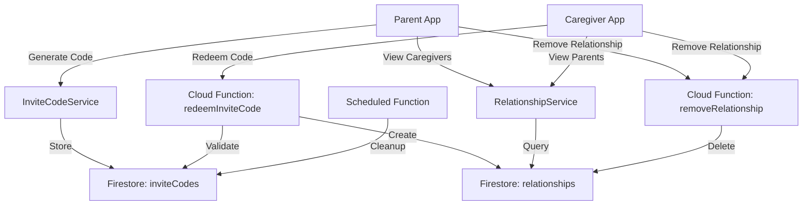
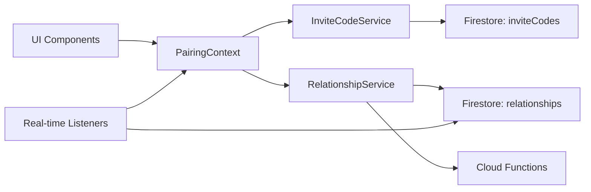
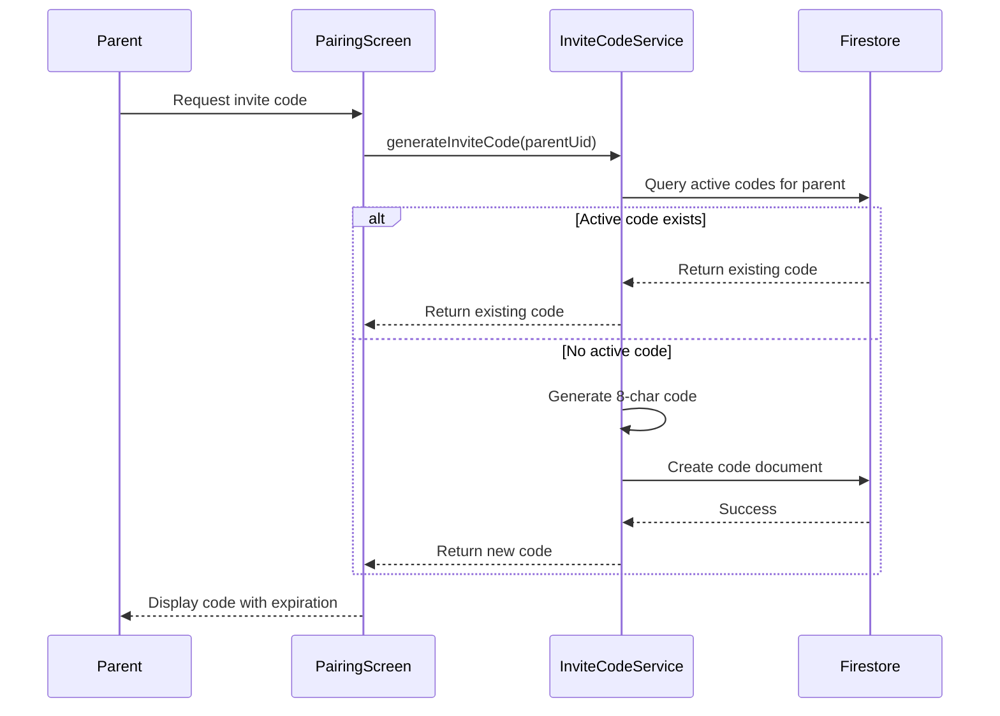
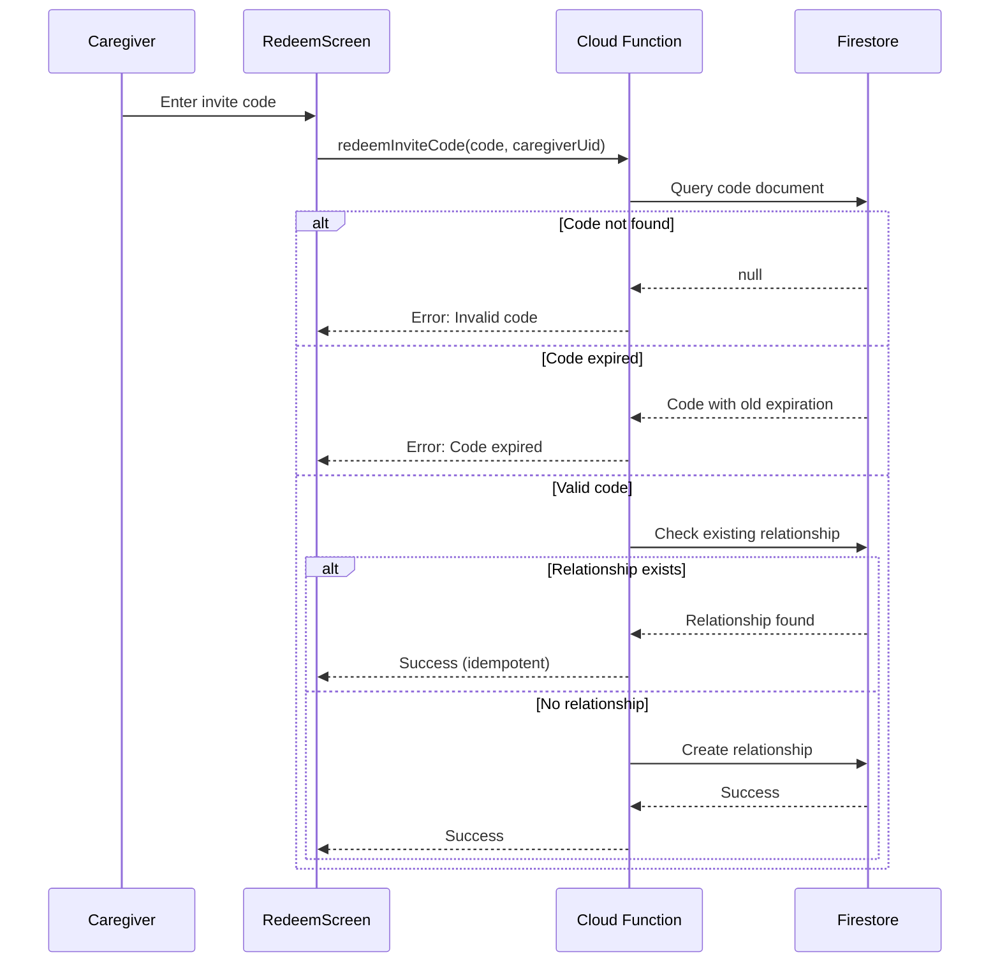

# Design Document: Pairing & Relationships System

## Overview

The Pairing & Relationships System enables secure connections between parents and caregivers in the PillSathi medication reminder app. The system uses time-limited invite codes generated by parents that caregivers can redeem to establish bidirectional relationships. The design supports many-to-many relationships, allowing parents to have multiple caregivers and caregivers to support multiple parents.

The system builds on Phase 1 (Authentication) where users have already authenticated and selected their role. It integrates with Firebase Firestore for data persistence, Cloud Functions for secure server-side operations, and React Native for the mobile UI.

### Key Design Decisions

1. **Time-Limited Invite Codes**: 24-hour TTL balances security with usability, preventing stale codes from being exploited
2. **Cloud Functions for Validation**: Server-side validation prevents client-side tampering and ensures consistent business logic
3. **Alphanumeric Codes**: 8-character codes (uppercase letters and numbers) provide sufficient entropy while remaining user-friendly
4. **Single Active Code per Parent**: Simplifies code management and prevents confusion about which code to share
5. **Real-time Listeners**: Firestore listeners provide instant updates when relationships change, improving UX for both parties
6. **Bidirectional Relationships**: Single relationship document serves both parent and caregiver, reducing data duplication
7. **Soft Delete Pattern**: Relationships are deleted immediately but could be extended to soft deletes for audit trails

## Architecture

### High-Level Architecture



### Component Architecture



### Invite Code Generation Flow



### Invite Code Redemption Flow



## Components and Interfaces

### 1. InviteCodeService

Handles invite code generation and management for parents.

**Interface:**

```javascript
class InviteCodeService {
  /**
   * Generate or retrieve active invite code for a parent
   * @param {string} parentUid - Parent's Firebase Auth UID
   * @returns {Promise<{code: string, expiresAt: Date}>}
   * @throws {Error} If generation fails
   */
  async generateInviteCode(parentUid)

  /**
   * Get active invite code for a parent
   * @param {string} parentUid - Parent's Firebase Auth UID
   * @returns {Promise<{code: string, expiresAt: Date} | null>}
   */
  async getActiveInviteCode(parentUid)

  /**
   * Check if invite code is expired
   * @param {Date} expiresAt - Expiration timestamp
   * @returns {boolean}
   */
  isCodeExpired(expiresAt)

  /**
   * Generate random alphanumeric code
   * @param {number} length - Code length (default: 8)
   * @returns {string} Uppercase alphanumeric code
   */
  generateRandomCode(length = 8)

  /**
   * Calculate expiration timestamp
   * @param {number} hours - Hours until expiration (default: 24)
   * @returns {Date}
   */
  calculateExpiration(hours = 24)
}
```

### 2. RelationshipService

Manages relationship viewing and removal operations.

**Interface:**

```javascript
class RelationshipService {
  /**
   * Get all relationships for a user (parent or caregiver)
   * @param {string} uid - User's Firebase Auth UID
   * @param {string} role - User's role ('parent' | 'caregiver')
   * @returns {Promise<Array<Relationship>>}
   */
  async getRelationships(uid, role)

  /**
   * Subscribe to real-time relationship updates
   * @param {string} uid - User's Firebase Auth UID
   * @param {string} role - User's role ('parent' | 'caregiver')
   * @param {Function} callback - Called with updated relationships array
   * @returns {Function} Unsubscribe function
   */
  subscribeToRelationships(uid, role, callback)

  /**
   * Remove a relationship
   * @param {string} relationshipId - Relationship document ID
   * @param {string} requestingUid - UID of user requesting removal
   * @returns {Promise<void>}
   * @throws {Error} If removal fails or user not authorized
   */
  async removeRelationship(relationshipId, requestingUid)

  /**
   * Get user profile for relationship display
   * @param {string} uid - User's Firebase Auth UID
   * @returns {Promise<{name: string, phone: string}>}
   */
  async getUserProfile(uid)
}
```

### 3. Cloud Functions

Server-side functions for secure operations.

**redeemInviteCode:**

```javascript
/**
 * Redeem an invite code to create a relationship
 * @param {Object} data - Request data
 * @param {string} data.code - Invite code to redeem
 * @param {string} data.caregiverUid - Caregiver's UID
 * @param {Object} context - Function context with auth
 * @returns {Promise<{success: boolean, relationshipId?: string, error?: string}>}
 */
exports.redeemInviteCode = functions.https.onCall(async (data, context) => {
  // Verify authentication
  if (!context.auth) {
    throw new functions.https.HttpsError(
      'unauthenticated',
      'User must be authenticated',
    );
  }

  const { code, caregiverUid } = data;

  // Validate input
  if (!code || !caregiverUid) {
    throw new functions.https.HttpsError(
      'invalid-argument',
      'Code and caregiverUid required',
    );
  }

  // Verify requesting user is the caregiver
  if (context.auth.uid !== caregiverUid) {
    throw new functions.https.HttpsError(
      'permission-denied',
      'Can only redeem codes for yourself',
    );
  }

  // Query invite code
  const codeSnapshot = await admin
    .firestore()
    .collection('inviteCodes')
    .where('code', '==', code.toUpperCase())
    .where('expiresAt', '>', admin.firestore.Timestamp.now())
    .limit(1)
    .get();

  if (codeSnapshot.empty) {
    throw new functions.https.HttpsError(
      'not-found',
      'Invalid or expired code',
    );
  }

  const codeDoc = codeSnapshot.docs[0];
  const { parentUid } = codeDoc.data();

  // Check for existing relationship (idempotent)
  const existingRelationship = await admin
    .firestore()
    .collection('relationships')
    .where('parentUid', '==', parentUid)
    .where('caregiverUid', '==', caregiverUid)
    .limit(1)
    .get();

  if (!existingRelationship.empty) {
    return {
      success: true,
      relationshipId: existingRelationship.docs[0].id,
      message: 'Relationship already exists',
    };
  }

  // Create relationship
  const relationshipRef = await admin
    .firestore()
    .collection('relationships')
    .add({
      parentUid,
      caregiverUid,
      createdAt: admin.firestore.FieldValue.serverTimestamp(),
      createdBy: caregiverUid,
    });

  return {
    success: true,
    relationshipId: relationshipRef.id,
  };
});
```

**removeRelationship:**

```javascript
/**
 * Remove a relationship between parent and caregiver
 * @param {Object} data - Request data
 * @param {string} data.relationshipId - Relationship document ID
 * @param {Object} context - Function context with auth
 * @returns {Promise<{success: boolean}>}
 */
exports.removeRelationship = functions.https.onCall(async (data, context) => {
  // Verify authentication
  if (!context.auth) {
    throw new functions.https.HttpsError(
      'unauthenticated',
      'User must be authenticated',
    );
  }

  const { relationshipId } = data;

  if (!relationshipId) {
    throw new functions.https.HttpsError(
      'invalid-argument',
      'relationshipId required',
    );
  }

  // Get relationship document
  const relationshipDoc = await admin
    .firestore()
    .collection('relationships')
    .doc(relationshipId)
    .get();

  if (!relationshipDoc.exists) {
    throw new functions.https.HttpsError('not-found', 'Relationship not found');
  }

  const { parentUid, caregiverUid } = relationshipDoc.data();

  // Verify user is part of the relationship
  if (context.auth.uid !== parentUid && context.auth.uid !== caregiverUid) {
    throw new functions.https.HttpsError(
      'permission-denied',
      'Not authorized to remove this relationship',
    );
  }

  // Delete relationship
  await relationshipDoc.ref.delete();

  return { success: true };
});
```

**cleanupExpiredInviteCodes (Scheduled):**

```javascript
/**
 * Cleanup expired invite codes (runs every hour)
 */
exports.cleanupExpiredInviteCodes = functions.pubsub
  .schedule('every 1 hours')
  .onRun(async context => {
    const cutoffTime = admin.firestore.Timestamp.fromDate(
      new Date(Date.now() - 48 * 60 * 60 * 1000), // 48 hours ago
    );

    const expiredCodes = await admin
      .firestore()
      .collection('inviteCodes')
      .where('expiresAt', '<', cutoffTime)
      .get();

    const batch = admin.firestore().batch();
    expiredCodes.docs.forEach(doc => {
      batch.delete(doc.ref);
    });

    await batch.commit();

    console.log(`Cleaned up ${expiredCodes.size} expired invite codes`);
    return null;
  });
```

### 4. PairingContext

React Context for managing pairing state across the app.

**State:**

```javascript
{
  inviteCode: {
    code: string,
    expiresAt: Date
  } | null,
  relationships: Array<{
    id: string,
    parentUid: string,
    caregiverUid: string,
    parentName: string,
    caregiverName: string,
    createdAt: Date
  }>,
  loading: boolean,
  error: string | null
}
```

**Methods:**

```javascript
/**
 * Generate invite code for parent
 * @returns {Promise<{code: string, expiresAt: Date}>}
 */
generateInviteCode();

/**
 * Redeem invite code for caregiver
 * @param {string} code - Invite code to redeem
 * @returns {Promise<void>}
 */
redeemInviteCode(code);

/**
 * Remove a relationship
 * @param {string} relationshipId - Relationship to remove
 * @returns {Promise<void>}
 */
removeRelationship(relationshipId);

/**
 * Refresh relationships list
 * @returns {Promise<void>}
 */
refreshRelationships();
```

### 5. UI Components

**ParentPairingScreen:**

- Display active invite code or generate button
- Show code with expiration countdown
- Share button with native share sheet
- List of linked caregivers
- Remove caregiver functionality

**CaregiverPairingScreen:**

- Input field for invite code
- Redeem button with validation
- List of linked parents
- Remove parent functionality

**RelationshipCard:**

- Display user name and phone
- Created date
- Remove button with confirmation

**InviteCodeDisplay:**

- Large, readable code display
- Copy to clipboard button
- Share button
- Expiration countdown timer

## Data Models

### Invite Code (Firestore Document)

**Collection:** `inviteCodes`  
**Document ID:** Auto-generated

```javascript
{
  code: string,              // 8-character uppercase alphanumeric
  parentUid: string,         // Firebase Auth UID of parent
  createdAt: Timestamp,      // Firestore server timestamp
  expiresAt: Timestamp,      // 24 hours after createdAt
  usedCount: number          // Number of times redeemed (for analytics)
}
```

**Indexes:**

- `code` (ascending) + `expiresAt` (descending)
- `parentUid` (ascending) + `expiresAt` (descending)

### Relationship (Firestore Document)

**Collection:** `relationships`  
**Document ID:** Auto-generated

```javascript
{
  parentUid: string,         // Firebase Auth UID of parent
  caregiverUid: string,      // Firebase Auth UID of caregiver
  createdAt: Timestamp,      // Firestore server timestamp
  createdBy: string          // UID of user who created (usually caregiver)
}
```

**Indexes:**

- `parentUid` (ascending) + `caregiverUid` (ascending) - for duplicate detection
- `caregiverUid` (ascending) - for caregiver queries
- `parentUid` (ascending) - for parent queries

### Firestore Security Rules

```javascript
rules_version = '2';
service cloud.firestore {
  match /databases/{database}/documents {

    // Invite Codes
    match /inviteCodes/{codeId} {
      // Parents can read their own codes
      allow read: if request.auth != null
        && request.auth.uid == resource.data.parentUid;

      // Parents can create codes for themselves
      allow create: if request.auth != null
        && request.auth.uid == request.resource.data.parentUid
        && request.resource.data.keys().hasAll(['code', 'parentUid', 'createdAt', 'expiresAt'])
        && request.resource.data.code is string
        && request.resource.data.code.size() == 8;

      // No direct updates or deletes (handled by Cloud Functions)
      allow update, delete: if false;
    }

    // Relationships
    match /relationships/{relationshipId} {
      // Users can read relationships they're part of
      allow read: if request.auth != null
        && (request.auth.uid == resource.data.parentUid
            || request.auth.uid == resource.data.caregiverUid);

      // No direct creates (must use Cloud Function)
      allow create: if false;

      // Users can delete relationships they're part of
      allow delete: if request.auth != null
        && (request.auth.uid == resource.data.parentUid
            || request.auth.uid == resource.data.caregiverUid);

      // No updates to relationships
      allow update: if false;
    }
  }
}
```

## Correctness Properties

_A property is a characteristic or behavior that should hold true across all valid executions of a system—essentially, a formal statement about what the system should do. Properties serve as the bridge between human-readable specifications and machine-verifiable correctness guarantees._

### Property 1: Invite Code Generation Completeness

_For any_ parent UID, generating an invite code should produce a code object containing: (1) an 8-character uppercase alphanumeric string, (2) the parent's UID, (3) a creation timestamp, and (4) an expiration timestamp exactly 24 hours after creation.

**Validates: Requirements 1.1, 1.2, 1.3**

### Property 2: Invite Code Generation Idempotence

_For any_ parent UID with an active unexpired invite code, calling generateInviteCode again should return the same code without creating a new document in Firestore.

**Validates: Requirements 1.5**

### Property 3: Expiration Time Calculation

_For any_ invite code and current timestamp, the code should be considered expired if and only if the current timestamp is greater than the expiresAt timestamp.

**Validates: Requirements 2.3, 3.3, 8.1, 8.3**

### Property 4: Invite Code Format Validation

_For any_ string input to the redemption function, the format validation should accept only strings that are exactly 8 characters long and contain only uppercase letters (A-Z) and digits (0-9).

**Validates: Requirements 3.1**

### Property 5: Relationship Creation from Valid Code

_For any_ valid unexpired invite code and caregiver UID, redeeming the code should create a relationship document containing the parent UID (from the code), the caregiver UID, and a creation timestamp.

**Validates: Requirements 3.5, 3.6**

### Property 6: Relationship Creation Idempotence

_For any_ existing relationship between a parent and caregiver, attempting to redeem an invite code again should return success without creating a duplicate relationship document.

**Validates: Requirements 3.7**

### Property 7: Relationship Query Correctness

_For any_ user UID and role, querying relationships should return all and only the relationships where the user is a participant (parentUid matches for parents, caregiverUid matches for caregivers).

**Validates: Requirements 4.1, 5.1**

### Property 8: Relationship Removal Authorization

_For any_ relationship document and requesting user UID, the removal operation should succeed if and only if the requesting user is either the parent or caregiver in that relationship.

**Validates: Requirements 6.2**

### Property 9: Invite Code Read Access Control

_For any_ invite code document and requesting user UID, read access should be granted if and only if the requesting user's UID matches the parentUid field in the code document.

**Validates: Requirements 7.1**

### Property 10: Relationship Read Access Control

_For any_ relationship document and requesting user UID, read access should be granted if and only if the requesting user's UID matches either the parentUid or caregiverUid field.

**Validates: Requirements 7.2**

### Property 11: Relationship Direct Creation Prevention

_For any_ authenticated user, attempting to directly create a relationship document in Firestore (bypassing the Cloud Function) should be denied by security rules.

**Validates: Requirements 7.3**

### Property 12: Relationship Deletion Access Control

_For any_ relationship document and requesting user UID, delete access should be granted if and only if the requesting user's UID matches either the parentUid or caregiverUid field.

**Validates: Requirements 7.4**

### Property 13: Cloud Function Authentication Requirement

_For any_ Cloud Function call (redeemInviteCode or removeRelationship), the function should reject the request with an authentication error if the request context does not contain valid authentication credentials.

**Validates: Requirements 7.5**

### Property 14: Error Message Specificity

_For any_ error type (invalid code, expired code, not found, permission denied, network error), the error handling system should map it to a specific, user-friendly error message (never returning undefined or a raw error code).

**Validates: Requirements 9.1**

## Error Handling

### Error Categories

**1. Invite Code Errors**

- Invalid code format (not 8 characters, contains invalid characters)
- Code not found in database
- Code expired (past expiresAt timestamp)
- Code generation failures

**2. Relationship Errors**

- Relationship not found
- Duplicate relationship (already exists)
- Permission denied (user not authorized)
- Relationship removal failures

**3. Authentication Errors**

- User not authenticated
- User UID mismatch (trying to act on behalf of another user)
- Invalid authentication token

**4. Network and Service Errors**

- Firestore unavailable
- Cloud Function timeout
- Network connectivity issues
- Rate limiting

### Error Handling Strategy

**User-Facing Errors:**

```javascript
const ERROR_MESSAGES = {
  // Invite Code Errors
  'invalid-code-format': 'Please enter a valid 8-character code',
  'code-not-found': 'This invite code is invalid. Please check and try again',
  'code-expired': 'This invite code has expired. Please ask for a new code',
  'code-generation-failed': 'Failed to generate invite code. Please try again',

  // Relationship Errors
  'relationship-not-found': 'Relationship not found',
  'relationship-exists': 'You are already connected with this user',
  'relationship-removal-failed':
    'Failed to remove relationship. Please try again',

  // Authentication Errors
  unauthenticated: 'Please log in to continue',
  'permission-denied': 'You do not have permission to perform this action',

  // Network Errors
  'network-error': 'Network error. Please check your connection and try again',
  'service-unavailable':
    'Service temporarily unavailable. Please try again later',
  timeout: 'Request timed out. Please try again',

  // Default
  default: 'An error occurred. Please try again',
};
```

**Error Recovery Patterns:**

1. **Retry with Exponential Backoff:**

```javascript
async function retryOperation(operation, maxRetries = 3) {
  for (let i = 0; i < maxRetries; i++) {
    try {
      return await operation();
    } catch (error) {
      if (i === maxRetries - 1) throw error;
      if (!isRetryableError(error)) throw error;

      const delay = Math.pow(2, i) * 1000; // 1s, 2s, 4s
      await new Promise(resolve => setTimeout(resolve, delay));
    }
  }
}

function isRetryableError(error) {
  return ['network-error', 'timeout', 'service-unavailable'].includes(
    error.code,
  );
}
```

2. **Optimistic UI Updates:**

```javascript
async function removeRelationship(relationshipId) {
  // Optimistically update UI
  const previousState = relationships;
  setRelationships(prev => prev.filter(r => r.id !== relationshipId));

  try {
    await relationshipService.removeRelationship(relationshipId);
  } catch (error) {
    // Rollback on error
    setRelationships(previousState);
    showError(error);
  }
}
```

3. **Graceful Degradation:**

```javascript
// If real-time listeners fail, fall back to polling
function subscribeToRelationships(uid, role, callback) {
  try {
    return relationshipService.subscribeToRelationships(uid, role, callback);
  } catch (error) {
    console.warn('Real-time sync unavailable, falling back to polling');
    return startPolling(uid, role, callback, 30000); // Poll every 30s
  }
}
```

**Error Logging:**

```javascript
function logError(error, context) {
  const errorLog = {
    timestamp: new Date().toISOString(),
    errorCode: error.code,
    errorMessage: error.message,
    userMessage: ERROR_MESSAGES[error.code] || ERROR_MESSAGES.default,
    context: {
      userId: context.userId,
      operation: context.operation,
      ...context.additionalData,
    },
    stack: error.stack,
  };

  // Log to console in development
  if (__DEV__) {
    console.error('Error:', errorLog);
  }

  // Send to error tracking service
  errorTracker.logError(errorLog);
}
```

## Testing Strategy

### Dual Testing Approach

The pairing and relationships system requires both unit tests and property-based tests to ensure comprehensive coverage:

- **Unit tests**: Verify specific examples, edge cases, and error conditions
- **Property tests**: Verify universal properties across all inputs

Together, these approaches provide comprehensive coverage where unit tests catch concrete bugs and property tests verify general correctness.

### Property-Based Testing

**Library:** Use `fast-check` for JavaScript property-based testing

**Configuration:**

- Minimum 100 iterations per property test
- Each test must reference its design document property
- Tag format: `// Feature: pairing-relationships, Property {number}: {property_text}`

**Custom Generators:**

```javascript
// Generate valid parent UIDs
const parentUidArb = fc.string({ minLength: 28, maxLength: 28 });

// Generate valid caregiver UIDs
const caregiverUidArb = fc.string({ minLength: 28, maxLength: 28 });

// Generate valid invite codes (8-char alphanumeric uppercase)
const inviteCodeArb = fc.stringOf(
  fc.constantFrom(...'ABCDEFGHIJKLMNOPQRSTUVWXYZ0123456789'),
  { minLength: 8, maxLength: 8 },
);

// Generate invalid invite codes
const invalidInviteCodeArb = fc.oneof(
  fc.string({ maxLength: 7 }), // Too short
  fc.string({ minLength: 9 }), // Too long
  fc.string().filter(s => /[^A-Z0-9]/.test(s)), // Invalid characters
  fc.constant(''), // Empty
);

// Generate timestamps
const timestampArb = fc.date();

// Generate expired codes
const expiredCodeArb = fc.record({
  code: inviteCodeArb,
  parentUid: parentUidArb,
  createdAt: timestampArb,
  expiresAt: fc.date({ max: new Date() }), // Past date
});

// Generate valid unexpired codes
const validCodeArb = fc.record({
  code: inviteCodeArb,
  parentUid: parentUidArb,
  createdAt: timestampArb,
  expiresAt: fc.date({ min: new Date() }), // Future date
});

// Generate relationships
const relationshipArb = fc.record({
  id: fc.uuid(),
  parentUid: parentUidArb,
  caregiverUid: caregiverUidArb,
  createdAt: timestampArb,
});
```

**Example Property Tests:**

```javascript
// Feature: pairing-relationships, Property 1: Invite Code Generation Completeness
test('generated invite codes contain all required fields', () => {
  fc.assert(
    fc.property(parentUidArb, async parentUid => {
      const result = await inviteCodeService.generateInviteCode(parentUid);

      expect(result.code).toBeDefined();
      expect(result.code).toHaveLength(8);
      expect(result.code).toMatch(/^[A-Z0-9]{8}$/);
      expect(result.parentUid).toBe(parentUid);
      expect(result.createdAt).toBeInstanceOf(Date);
      expect(result.expiresAt).toBeInstanceOf(Date);

      const hoursDiff =
        (result.expiresAt - result.createdAt) / (1000 * 60 * 60);
      expect(hoursDiff).toBeCloseTo(24, 1);
    }),
    { numRuns: 100 },
  );
});

// Feature: pairing-relationships, Property 4: Invite Code Format Validation
test('code format validation accepts only valid 8-char alphanumeric codes', () => {
  fc.assert(
    fc.property(fc.oneof(inviteCodeArb, invalidInviteCodeArb), code => {
      const isValid = validateInviteCodeFormat(code);
      const shouldBeValid = /^[A-Z0-9]{8}$/.test(code);
      expect(isValid).toBe(shouldBeValid);
    }),
    { numRuns: 100 },
  );
});

// Feature: pairing-relationships, Property 6: Relationship Creation Idempotence
test('redeeming code twice does not create duplicate relationships', () => {
  fc.assert(
    fc.property(validCodeArb, caregiverUidArb, async (code, caregiverUid) => {
      // First redemption
      const result1 = await redeemInviteCode(code.code, caregiverUid);
      expect(result1.success).toBe(true);

      // Second redemption
      const result2 = await redeemInviteCode(code.code, caregiverUid);
      expect(result2.success).toBe(true);

      // Check only one relationship exists
      const relationships = await getRelationships(caregiverUid, 'caregiver');
      const matchingRelationships = relationships.filter(
        r => r.parentUid === code.parentUid && r.caregiverUid === caregiverUid,
      );
      expect(matchingRelationships).toHaveLength(1);
    }),
    { numRuns: 100 },
  );
});
```

### Unit Testing

**Test Categories:**

**1. Invite Code Generation Tests**

- Test code generation creates 8-character alphanumeric code
- Test code generation stores correct fields in Firestore
- Test TTL calculation is exactly 24 hours
- Test idempotence (same code returned for active code)
- Test code uniqueness across multiple parents
- Test error handling for Firestore failures

**2. Invite Code Redemption Tests**

- Test successful redemption creates relationship
- Test expired code rejection
- Test invalid code rejection
- Test non-existent code rejection
- Test duplicate relationship handling (idempotence)
- Test authentication requirement
- Test authorization (caregiver can only redeem for themselves)

**3. Relationship Query Tests**

- Test parent can query their relationships
- Test caregiver can query their relationships
- Test query returns correct relationships
- Test query excludes relationships user is not part of
- Test empty state handling

**4. Relationship Removal Tests**

- Test parent can remove relationship
- Test caregiver can remove relationship
- Test unauthorized user cannot remove relationship
- Test removal of non-existent relationship
- Test confirmation dialog display

**5. Security Rules Tests**

- Test invite code read access (only parent)
- Test relationship read access (only participants)
- Test relationship direct creation blocked
- Test relationship deletion access (only participants)
- Test unauthenticated access blocked

**6. Real-time Sync Tests**

- Test listener setup and teardown
- Test updates propagate to listeners
- Test listener handles relationship creation
- Test listener handles relationship deletion
- Test listener error handling

**7. UI Component Tests**

- Test invite code display formatting
- Test expiration countdown display
- Test share functionality
- Test code input validation
- Test relationship list rendering
- Test empty states
- Test loading states
- Test error message display

**8. Error Handling Tests**

- Test error message mapping for all error codes
- Test retry logic for network errors
- Test optimistic UI updates and rollback
- Test graceful degradation (polling fallback)

### Integration Tests

**1. Complete Pairing Flow**

```javascript
test('complete pairing flow: parent generates code, caregiver redeems', async () => {
  // Parent generates code
  const parent = await createTestUser('parent');
  const code = await inviteCodeService.generateInviteCode(parent.uid);
  expect(code.code).toHaveLength(8);

  // Caregiver redeems code
  const caregiver = await createTestUser('caregiver');
  const result = await redeemInviteCode(code.code, caregiver.uid);
  expect(result.success).toBe(true);

  // Verify relationship exists for both users
  const parentRelationships = await getRelationships(parent.uid, 'parent');
  expect(parentRelationships).toHaveLength(1);
  expect(parentRelationships[0].caregiverUid).toBe(caregiver.uid);

  const caregiverRelationships = await getRelationships(
    caregiver.uid,
    'caregiver',
  );
  expect(caregiverRelationships).toHaveLength(1);
  expect(caregiverRelationships[0].parentUid).toBe(parent.uid);
});
```

**2. Multi-Caregiver Scenario**

```javascript
test('parent can have multiple caregivers', async () => {
  const parent = await createTestUser('parent');
  const code = await inviteCodeService.generateInviteCode(parent.uid);

  // Three caregivers redeem the same code
  const caregiver1 = await createTestUser('caregiver');
  const caregiver2 = await createTestUser('caregiver');
  const caregiver3 = await createTestUser('caregiver');

  await redeemInviteCode(code.code, caregiver1.uid);
  await redeemInviteCode(code.code, caregiver2.uid);
  await redeemInviteCode(code.code, caregiver3.uid);

  // Verify parent has 3 relationships
  const relationships = await getRelationships(parent.uid, 'parent');
  expect(relationships).toHaveLength(3);
});
```

**3. Relationship Removal Flow**

```javascript
test('removing relationship updates both users', async () => {
  // Create relationship
  const parent = await createTestUser('parent');
  const caregiver = await createTestUser('caregiver');
  const code = await inviteCodeService.generateInviteCode(parent.uid);
  await redeemInviteCode(code.code, caregiver.uid);

  // Get relationship ID
  const relationships = await getRelationships(parent.uid, 'parent');
  const relationshipId = relationships[0].id;

  // Parent removes relationship
  await removeRelationship(relationshipId, parent.uid);

  // Verify removed for both users
  const parentRelationships = await getRelationships(parent.uid, 'parent');
  expect(parentRelationships).toHaveLength(0);

  const caregiverRelationships = await getRelationships(
    caregiver.uid,
    'caregiver',
  );
  expect(caregiverRelationships).toHaveLength(0);
});
```

### Testing Tools

- **Jest**: Test runner and assertion library
- **React Native Testing Library**: Component testing
- **fast-check**: Property-based testing
- **Firebase Test SDK**: Mock Firebase services
- **@testing-library/react-hooks**: Test custom hooks

### Mock Strategy

**Firebase Mocks:**

```javascript
// Mock Firestore
jest.mock('@react-native-firebase/firestore', () => ({
  collection: jest.fn(() => ({
    doc: jest.fn(() => ({
      set: jest.fn(),
      get: jest.fn(),
      delete: jest.fn(),
    })),
    where: jest.fn(() => ({
      where: jest.fn(),
      limit: jest.fn(() => ({
        get: jest.fn(),
      })),
      get: jest.fn(),
      onSnapshot: jest.fn(),
    })),
    add: jest.fn(),
  })),
  FieldValue: {
    serverTimestamp: jest.fn(() => new Date()),
  },
  Timestamp: {
    now: jest.fn(() => ({ toDate: () => new Date() })),
    fromDate: jest.fn(date => ({ toDate: () => date })),
  },
}));

// Mock Cloud Functions
jest.mock('@react-native-firebase/functions', () => ({
  httpsCallable: jest.fn(functionName => {
    return jest.fn(async data => {
      // Mock implementation
      return { data: { success: true } };
    });
  }),
}));
```

### Test Coverage Goals

- **Line Coverage**: Minimum 80%
- **Branch Coverage**: Minimum 75%
- **Function Coverage**: Minimum 85%
- **Critical Paths**: 100% coverage for invite code generation, redemption, and relationship management

### Continuous Testing

- Run unit tests on every commit
- Run property tests on pull requests
- Run integration tests before deployment
- Monitor test execution time and optimize slow tests
- Maintain test documentation and examples
